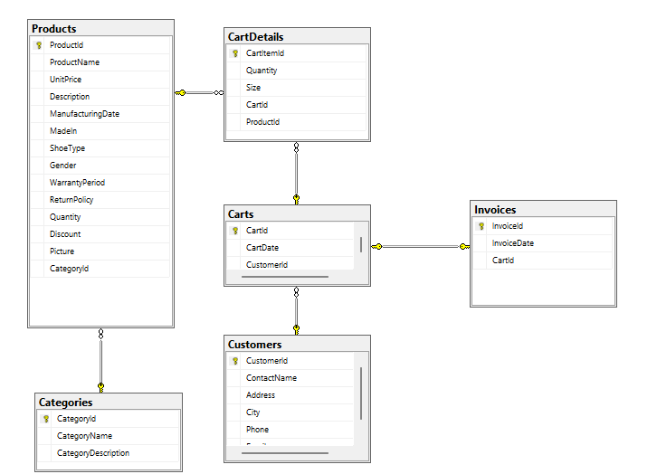
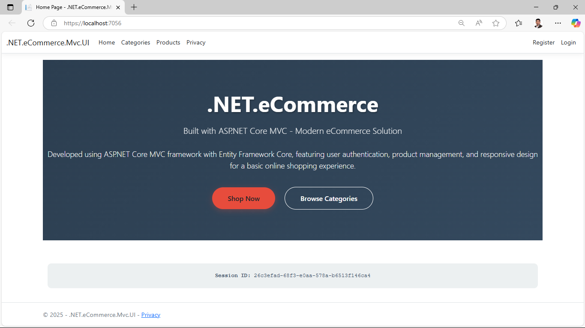
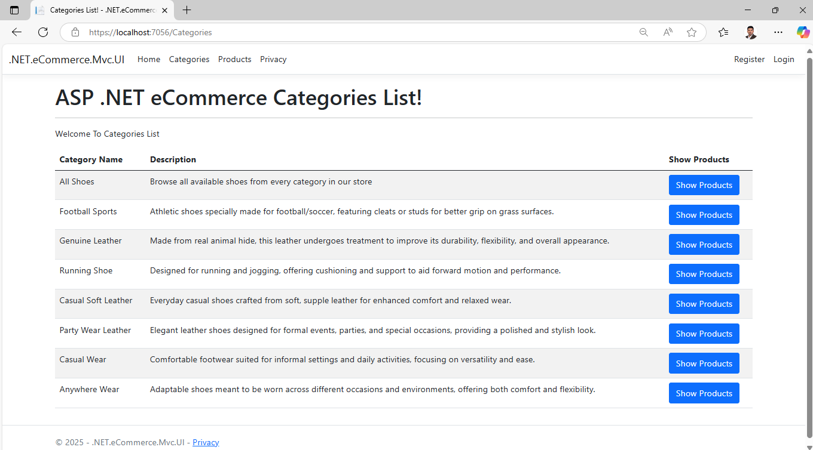
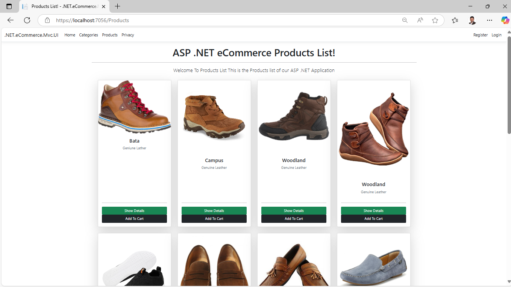
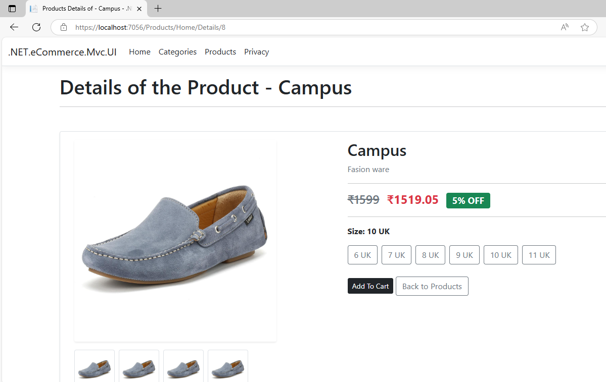
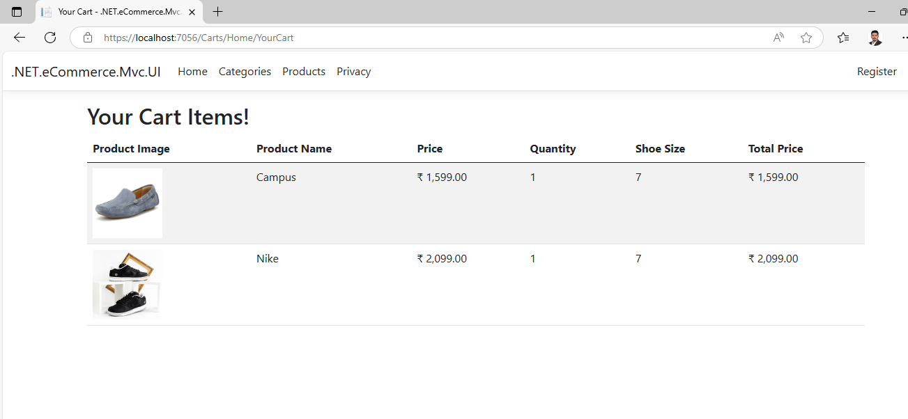

# 🛒 ASP.NET Core 8 MVC eCommerce Application

[](https://dotnet.microsoft.com/)
[](https://docs.microsoft.com/en-us/aspnet/core/mvc/)
[](https://docs.microsoft.com/en-us/ef/core/)
[](https://www.microsoft.com/en-us/sql-server)

## 📋 Table of Contents
- [Overview](https://github.com/KARRTHIKKKK/ASP.NET_Core-8_MVC_eCommerce_Application/blob/master/README.md#-overview)
- [Demo Video](https://github.com/KARRTHIKKKK/ASP.NET_Core-8_MVC_eCommerce_Application/blob/master/README.md#-demo-video)
- [Features](https://github.com/KARRTHIKKKK/ASP.NET_Core-8_MVC_eCommerce_Application/blob/master/README.md#-features)
- [Technologies Used](#technologies-used)
- [Solution Architecture](#solution-architecture)
- [Getting Started](#getting-started)
- [Installation](#installation)
- [Configuration](#configuration)
- [Usage](#usage)
- [Project Structure](#project-structure)
- [Database Schema](#database-schema)
- [Screenshots](#screenshots)
- [Contributing](#contributing)
- [License](#license)

## 🔷 Overview

A **modular, full-stack eCommerce web application** built using **ASP.NET Core 8 MVC** following industry best practices with clean architecture, Identity-based authentication, and Entity Framework Core integration. This application demonstrates modern web development patterns including repository pattern, dependency injection, and area-based feature organization.

## 🎥 Demo Video

### YouTube Link
- [📺 Watch on YouTube](https://www.youtube.com/watch?v=7XIx_slTZ2g)

## ✨ Features

### 🛍️ Core eCommerce Functionality
- **Product Catalog** - Browse and search products
- **Shopping Cart** - Add, remove, and manage cart items
- **User Authentication** - Register, login, and user management
- **Responsive Design** - Mobile-friendly Bootstrap UI

### 🏗️ Technical Features
- **Modular Architecture** - Area-based feature separation
- **Repository Pattern** - Clean data access layer
- **Code-First Migrations** - Database schema management
- **Identity Integration** - Secure user authentication
- **Strongly-Typed Views** - ViewModels for data binding

## 🔨 Technologies Used

| Category | Technology |
|----------|------------|
| **Framework** | ASP.NET Core 8 MVC |
| **ORM** | Entity Framework Core 8 |
| **Database** | SQL Server |
| **Authentication** | ASP.NET Core Identity |
| **Frontend** | Bootstrap, Razor Views, HTML5, CSS3, JavaScript |
| **Architecture** | Repository Pattern, Dependency Injection |
| **Development** | Visual Studio, Code-First Migrations |

## 🏛️ Solution Architecture

```
Sandhata.eCommerce.Solution/
├── 📁 Sandhata.eCommerce.Models/          # Data Models & ViewModels
├── 📁 Sandhata.eCommerce.Repositories/    # Data Access Layer
└── 📁 Sandhata.eCommerce.Mvc.UI/          # MVC Web Application
```

### **1. Sandhata.eCommerce.Models**
- **Data Models**: `Product`, `Cart`, `Customer`, `Invoice`
- **ViewModels**: `YourCartVM` for composite view rendering
- **DTOs**: Data transfer objects for API communication

### **2. Sandhata.eCommerce.Repositories**
- **Repository Interfaces**: `ICartRepository`, `ICommonRepository`
- **Implementation**: Concrete repository classes
- **Database Context**: `SandhataDbContext` with EF Core
- **Migrations**: Code-first database schema management

### **3. Sandhata.eCommerce.Mvc.UI**
- **Areas**: Feature-based organization (`Carts`, `Products`, `Invoices`)
- **Controllers**: MVC controllers for each feature area
- **Views**: Razor views with shared layouts
- **Static Content**: CSS, JavaScript, images in `wwwroot`

## 🚀 Getting Started

### Prerequisites
- Min 16GB RAM with Windows 10
- IDE     : [Visual Studio 2022 Community](https://apps.microsoft.com/detail/XPDCFJDKLZJLP8?hl=en-GB&gl=IN&ocid=pdpshare)
- Runtime : [.NET 8 SDK](https://dotnet.microsoft.com/download/dotnet/8.0)
- Database: [Microsoft SQL Server 2019](https://www.microsoft.com/en-in/download/details.aspx?id=101064)
- SSMS    : [SQL Server Management Studio:](https://learn.microsoft.com/en-us/ssms/install/install)

## 📁 Project Structure

```
Sandhata.eCommerce.Mvc.UI/
├── 📁 Areas/
│   ├── 📁 Carts/
│   │   ├── Controllers/
│   │   └── Views/
│   ├── 📁 Products/
│   │   ├── Controllers/
│   │   └── Views/
│   └── 📁 Invoices/
│       ├── Controllers/
│       └── Views/
├── 📁 Controllers/           # Main controllers
├── 📁 Views/
│   ├── 📁 Shared/
│   │   ├── _Layout.cshtml
│   │   └── _LoginPartial.cshtml
│   └── Home/
├── 📁 wwwroot/              # Static files
│   ├── css/
│   ├── js/
│   └── images/
├── 📁 Data/                 # Database context
├── appsettings.json
└── Program.cs
```
## 📸 Screenshots
### 🗄️ Database Schema


### Home Page


### Categories Page


### Product Catalog


### Show Details


### Add To Cart


<!--
## 🚀 Future Enhancements

- [ ] Payment gateway integration (Stripe, PayPal)
- [ ] Admin panel for product management
- [ ] Order tracking system
- [ ] Email notifications
- [ ] Product reviews and ratings
- [ ] Wishlist functionality
- [ ] Multi-language support
- [ ] API endpoints for mobile app
-->


## 📝 License

This project is licensed under the MIT License - see the [LICENSE](LICENSE) file for details.

## 👨‍💻 Author

**Your Name**
- GitHub: [@KARRTHIKKKK](https://github.com/KARRTHIKKKK)
- LinkedIn: [Kathikeya Pepeti](https://www.linkedin.com/in/karthikeya-pepeti/)
- Email: karthikeyapepeti05@gmail.com

## 🙏 Acknowledgments

- ASP.NET Core team for the excellent framework
- Bootstrap team for the responsive UI components
- Entity Framework team for the robust ORM
- Community contributors and My Trainer : Praveen Dabde

---

⭐ **If you found this project helpful, please give it a star!** ⭐

---
*Built with ❤️ using ASP.NET Core 8*
